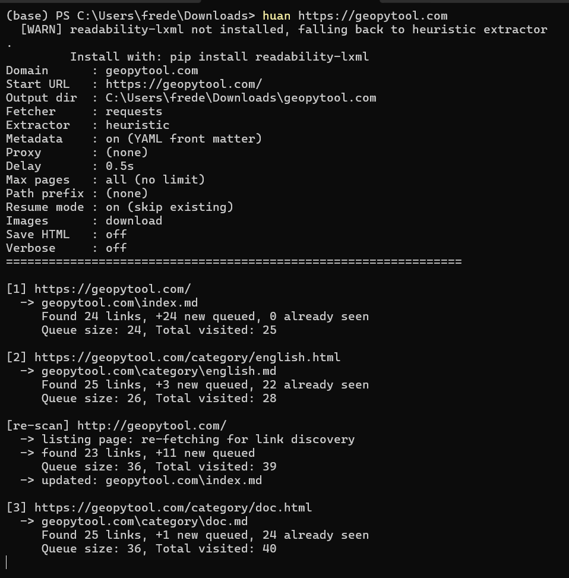
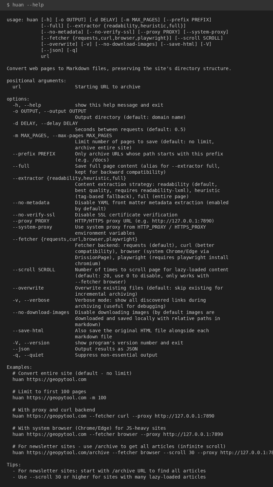

# huan (换)

一个命令行工具，用于将网页转换为完美的 Markdown 文件。默认只下载提供的链接，使用 `-r` 可递归转换整个网站。

"huan"（换）在中文里意为"转换"。

## 功能特性

- **单页或全站** - 默认：只下载提供的链接，输出完美 Markdown。使用 `-r` 递归转换整个网站
- **完美 Markdown** - 清晰、格式良好的 Markdown，支持公式、代码块和图片
- **图片下载** - 下载所有图片到 `images/` 目录，Markdown 中使用相对路径引用
- **数学公式转换** - 将 MathML、MathJax、KaTeX 转换为 LaTeX 格式
- **智能内容提取** - 使用 Mozilla Readability 算法实现高质量正文提取（通过 readability-lxml）
- **丰富元数据** - 自动提取标题、作者、日期、Open Graph、Schema.org 等信息，以 YAML front matter 格式输出
- **多种 HTTP 后端** - 可选 requests、curl_cffi、DrissionPage（系统浏览器）或 Playwright
- **无限滚动支持** - 自动滚动加载懒加载内容
- **代码块语言识别** - 保留 HTML 中的语言标注，输出正确的 Markdown 代码围栏
- **表格预处理** - 处理含有 colspan/rowspan 的复杂表格，输出更清晰的 Markdown 表格
- **Token 估算** - 输出字数统计和 Token 估算值，方便 LLM 用量规划
- **增量模式** - 跳过已存在的文件，高效地进行重复转换
- **代理支持** - 支持手动指定代理或使用系统环境变量
- **保存原始 HTML** - 可选同时保存原始 HTML 文件

## 安装

从 PyPI 安装：
```bash
pip install huan
```

如需安装最新开发版：
```bash
git clone https://github.com/cycleuser/Huan.git
cd Huan
pip install -e .
```

### 可选依赖

更好的内容提取质量（推荐）：
```bash
pip install -e ".[readability]"
```

更好的浏览器兼容性：
```bash
pip install -e ".[curl]"
```

用于 JavaScript 重度依赖的网站：
```bash
pip install -e ".[browser]"   # 使用系统 Chrome/Edge（DrissionPage）
```

安装所有可选依赖：
```bash
pip install -e ".[all]"
```

## 使用方法

### 基础用法

```bash
# 转换单个页面为 Markdown（默认行为）
huan https://geopytool.com/article-123

# 递归转换整个网站
huan https://geopytool.com -r

# 限制递归转换前 100 个页面
huan https://geopytool.com -r -m 100

# 指定输出目录
huan https://geopytool.com/article -o ./my-archive
```

### 内容提取

```bash
# 默认：readability 提取（最佳质量，需要 readability-lxml）
huan https://geopytool.com/article

# 启发式提取（基于标签匹配，无需额外依赖）
huan https://geopytool.com/article --extractor heuristic

# 完整页面内容（不做提取过滤）
huan https://geopytool.com/article --extractor full
```

### 元数据

每个 Markdown 文件顶部都包含 YAML front matter 格式的元数据：

```yaml
---
title: "文章标题"
author: "作者名称"
published: 2024-01-15
url: "https://geopytool.com/article"
language: zh
word_count: 2847
estimated_tokens: 3701
---
```

如需禁用元数据提取：
```bash
huan https://geopytool.com/article --no-metadata
```

### 使用代理

```bash
# 手动指定代理
huan https://geopytool.com/article --proxy http://127.0.0.1:7890

# 使用系统代理（从 HTTP_PROXY/HTTPS_PROXY 环境变量读取）
huan https://geopytool.com/article --system-proxy
```

### 使用不同的后端

部分网站使用 JavaScript 渲染内容，默认的 `requests` 后端无法处理此类页面。如果工具返回 0 个链接或内容不完整，请尝试切换后端：

```bash
# 默认：标准 requests 库（速度快，适合静态网站）
huan https://geopytool.com/article

# curl_cffi 后端（兼容更多网站）
huan https://geopytool.com/article --fetcher curl

# 系统浏览器（推荐用于 JS 渲染的网站）
huan https://geopytool.com/article --fetcher browser

# Playwright（需要先运行：playwright install chromium）
huan https://geopytool.com/article --fetcher playwright
```

**提示**：如果默认的 `requests` 后端在某个页面发现 0 个链接，工具会自动输出警告，建议尝试 `--fetcher curl` 或 `--fetcher browser`。

### 无限滚动页面

```bash
# 新闻订阅类网站：使用 /archive 端点 + browser 后端 + 递归
huan https://geopytool.com/archive -r --fetcher browser --scroll 50

# 带无限滚动的博客平台
huan https://geopytool.com/ -r --fetcher browser --scroll 30
```

### 其他选项

```bash
# 同时保存原始 HTML
huan https://geopytool.com/article --save-html

# 禁用图片下载
huan https://geopytool.com/article --no-download-images

# 覆盖已存在的文件（禁用增量模式）
huan https://geopytool.com/article --overwrite

# 只转换 /docs 路径下的页面（递归模式）
huan https://geopytool.com -r --prefix /docs

# 详细输出，用于调试
huan https://geopytool.com/article -v
```

## 命令行参数

| 参数 | 说明 |
|------|------|
| `url` | 起始 URL（必需） |
| `-o, --output` | 输出目录（默认：域名） |
| `-d, --delay` | 请求间隔秒数（默认：0.5） |
| `-m, --max-pages` | 最大页面数限制（默认：无限制） |
| `-r, --recursive` | 递归转换整个网站（默认：只下载单页） |
| `--prefix` | 只转换此路径前缀的 URL（递归模式） |
| `--extractor` | 内容提取：readability、heuristic、full |
| `--full` | `--extractor full` 的快捷别名 |
| `--no-metadata` | 禁用 YAML front matter 元数据 |
| `--no-verify-ssl` | 禁用 SSL 证书验证 |
| `--proxy` | HTTP/HTTPS 代理 URL |
| `--system-proxy` | 使用系统环境变量中的代理 |
| `--fetcher` | 后端：requests、curl、browser、playwright |
| `--scroll` | 懒加载内容滚动次数（默认：20） |
| `--overwrite` | 覆盖已存在的文件 |
| `-v, --verbose` | 详细输出 |
| `--no-download-images` | 跳过图片下载 |
| `--save-html` | 同时保存原始 HTML |
| `--version` | 显示版本号 |

## 输出结构

```
example.com/
├── index.md
├── about.md
├── blog/
│   ├── index.md
│   ├── post-1.md
│   └── post-2.md
├── images/
│   ├── logo.png
│   └── hero.jpg
└── _external/
    └── cdn.example.com/
        └── assets/
            └── image.webp
```

- Markdown 文件镜像网站的 URL 结构
- 同域图片保留原路径保存
- 外部 CDN 图片保存在 `_external/{域名}/` 下
- Markdown 中的图片引用使用相对路径

## Python API

```python
from huan import SiteCrawler

# 单页（默认）
converter = SiteCrawler(
    start_url="https://geopytool.com/article-123",
    output_dir="./archive",
    download_images=True,
    extractor="readability",
)
converter.crawl()

# 递归转换
converter = SiteCrawler(
    start_url="https://geopytool.com",
    output_dir="./archive",
    max_pages=50,
    fetcher_type="browser",
    download_images=True,
    extractor="readability",
    recursive=True,
)
converter.crawl()
```

## 系统要求

- Python 3.10+
- requests
- beautifulsoup4
- html2text

可选依赖：
- readability-lxml（更好的内容提取）
- curl-cffi（更好的兼容性）
- DrissionPage（系统浏览器）
- playwright（无头 Chromium）

## 运行截图



## Agent 集成（OpenAI Function Calling）

Huan 提供 OpenAI 兼容的工具定义，可供 LLM Agent 调用：

```python
from huan.tools import TOOLS, dispatch

response = client.chat.completions.create(
    model="gpt-4o",
    messages=messages,
    tools=TOOLS,
)

result = dispatch(
    tool_call.function.name,
    tool_call.function.arguments,
)
```

## CLI 帮助



## 许可证

MIT License - 详见 [LICENSE](LICENSE) 文件。
